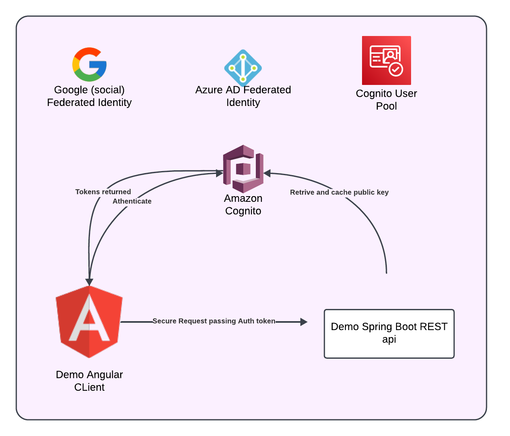

# Cognito + Angular + Spring Boot Demo

This is a demo project illustrating how to integrate **Amazon Cognito** with an **Angular** front-end and a **Spring Boot** back-end. Users can create an account, log in, and then use the **access token** to call protected endpoints in the Spring service.

The cognito service can be cogfigured to authenticate users using a variety of methods, including social logins, SAML, and OpenID Connect. This demo focuses on the **Authorization Code Grant** flow, where the Angular app redirects users to the Cognito Hosted UI to enter their credentials.  While testing the demo, cognito was successfully configured to authenicate against a user pool, google, and Microsoft Azure AD (EID Connect) using the OIDC pattern (SAML could also be used to connect to a microsoft domain).

---

## Prerequisites

1. **AWS Account**  
   - You need an AWS account with permissions to create and configure a **Cognito User Pool**.  

2. **Cognito User Pool**  
   - Create a new **User Pool** in the [AWS Console](https://console.aws.amazon.com/cognito/).  
   - Enable the **Authorization code grant** flow.  
   - Configure **Allowed Callback URLs** for your local Angular app (e.g., `http://localhost:4200` or `http://localhost:4200/auth-callback`).  
   - Make sure you enable the **Use a refresh token** setting if you plan to refresh tokens in your Angular app.  

3. **Development Tools**  
   - **Git** for cloning this repository.  
   - An IDE or editor (e.g., **VS Code**, **IntelliJ**, **Eclipse**) that can build and run a **Spring Boot** project.  
   - **Node.js** and **npm** (or **yarn**) for building and running the Angular app.  
   - **Java 17** (or the version supported by your Spring Boot project).

---

## Architecture & Flow

The application is composed of:

- **Angular App**: Basic UI provides login, logout, and GET request to secure endpoint. Links to Hosted User registration, and login via **Cognito** using the [`angular-auth-oidc-client`](https://github.com/damienbod/angular-auth-oidc-client) library.  
- **Spring Boot REST API**: Provides sample protected REST endpoints. Spring Security intercepts and validates **JWT** tokens (access tokens from Cognito) before routing to protected endpoints.  
- **Cognito**: Hosts the sign-in page and user sign-up (Hosted UI), issues tokens upon successful authentication.

### High-Level Architecture



### Basic OAuth Sequence Diagram - using Authorization Code Grant and Cognito user pool

- **The user clicks Login in the Angular app.**
- **The app redirects the user to the Cognito Hosted UI to enter credentials.**
- **Cognito authenticates the user and issues an authorization code.**
- **The user is redirected back to the Angular app with the code.**
- **The Angular app exchanges the code for access and ID tokens from Cognito.**
- **The Angular app attaches the access token in the Authorization header for any protected API calls.**
- **The Spring Boot back-end validates the token using Cognito’s JWKS endpoint.**

if the user chooses to login with an external provider, the flow is similar, but the user is redirected to the social provider’s login page instead of the Cognito Hosted UI.

## Quick Start: How to Clone & Run

1. Clone the Repository

2. Configure Cognito Details in the Angular configuration file (e.g., src/app/auth.config.ts):
```
    export const authConfig: AuthConfig = {
    authority: 'https://<your-cognito-domain>.auth.<region>.amazoncognito.com',
    clientId: '<your-cognito-app-client-id>',
    redirectUrl: 'http://localhost:4200/auth-callback',
    postLogoutRedirectUri: 'http://localhost:4200',
    scope: 'openid profile email',
    responseType: 'code',
    // ...
};
```
3. Configure Spring Security Details in Spring Boot application.yml (or .properties):

        spring:
            security:
                oauth2:
                resourceserver:
                    jwt:
                    issuer-uri: https://cognito-idp.<region>.amazonaws.com/<your-user-pool-id>

    Cognito app client settings:

    - Allowed Callback URLs must match the redirectUrl.
    - Allowed Logout URLs must match the postLogoutRedirectUri.
    - Enable "Authorization code grant" and "Use a refresh token."

4. Run the Spring Boot App

    - mvn spring-boot:run
    - Your API should start on http://localhost:8080.
    - Alternatively, use your IDE’s Spring Boot runner.

5. Run the Angular App

    - npm install
    - ng serve (or whatever your preferred Angular build command is)
    - Access the Angular app at http://localhost:4200.
    - Click Login to go through the Cognito Hosted UI and log in.

6. Test the Protected Endpoints

    - Sign up or log in with your Cognito user account.
    - Once authenticated, the Angular app retrieves an access token.  You should see the user data as well as both the decoded access and id tokens. 
    - Try calling a protected endpoint using the sample button . You should see a successful response if your token is valid.  Logout, try the endpoint again, you should recieve a 401 unauthorized response.

## Troubleshooting

- Callback URL Mismatch: Confirm your Cognito app client has exactly the same callback URLs as your Angular config.
- Stale Code Error: If you refresh the page after returning with ?code=..., the code may be expired or already used.

